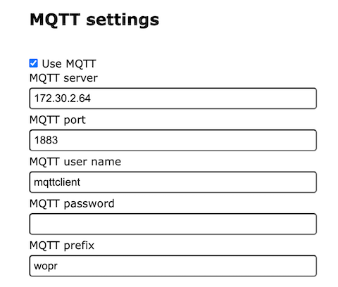
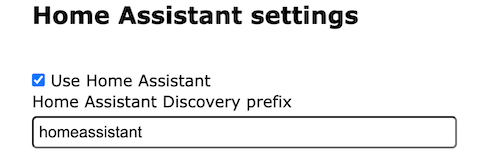
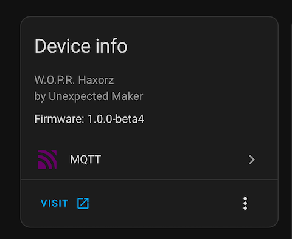
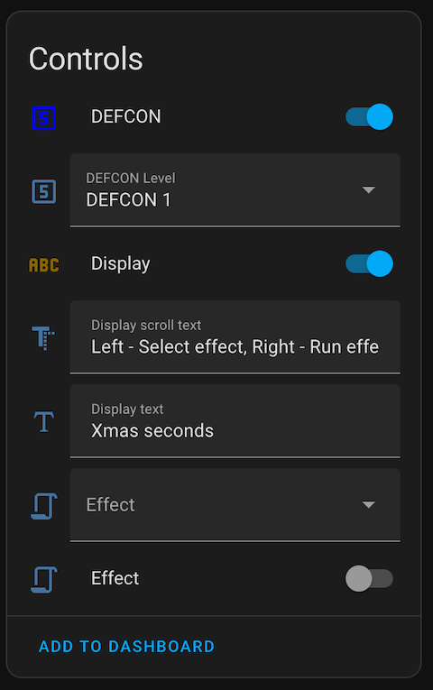
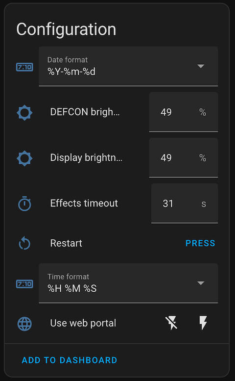
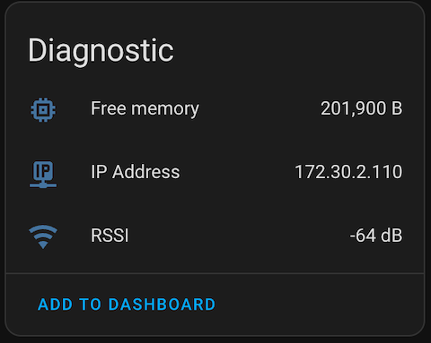

# JBWopr

[](https://www.ardu-badge.com/JBWopr)


JBWopr is a helper library for the Arduino platform that allows you to easily interface with the 
Unexpected Maker W.O.P.R. board.

## Installation

Install using the library manager in the Arduino IDE.

This library is compatible with the ESP32 Arduino core version 2.x and 3.x.

## Usage

The library exposes several classes that you can use to interact with the board.

 - `JBWoprDevice` - This is the simplest class that you can use to interact with the board.
 - `JBWoprWifiDevice` - This adds WiFiManager and web configuration portal support to the `JBWoprDevice` class.
 - `JBWoprMqttDevice` - This adds MQTT support to the `JBWoprWifiDevice` class.
 - `JBWoprHomeAssistantDevice` - This adds Home Assistant support to the `JBWoprMqttDevice` class.

## Dependencies

Depending on the class used the following libraries need to be installed. They can all be installed using the Library Manager.

### JBWoprDevice

 - [JBLogger](https://github.com/jonnybergdahl/Arduino_JBLogger_Library)
 - [Adafruit_GFX>](https://github.com/adafruit/Adafruit-GFX-Library)
 - [Adafruit_LEDBackpack](https://github.com/adafruit/Adafruit_LED_Backpack)
 - [Adafruit_NeoPixel](https://github.com/adafruit/Adafruit_NeoPixel)
 - [OneButton](https://github.com/mathertel/OneButton)
 - [ArduinoJson](https://github.com/bblanchon/ArduinoJson)

### JBWoprWifiDevice

The above, plus: 

 - [WiFiManager](https://github.com/tzapu/WiFiManager)

### JBWoprMqttDevice

The above, plus: 

 - [WiFiManager](https://github.com/tzapu/WiFiManager)

### Compiling the examples

Due to the size of the library, you may need to change the partition size in the Arduino IDE.

| Board            | Minimum `Partition Scheme`                        |
|------------------|---------------------------------------------------|
| TinyPICO / ESP32 | Minimal SPIFFS (Large APPS with OTA)              |
| TinyS2 / ESP32S2 | Minimal SPIFFS (1.9MB APP with OTA/190 KB SPIFFS) |
| TinyS3 / ESP32S3 | Default (3MB APP with OTA/1.5MB SPIFFS)           |

### Quick start

Open the example 'JBWopr_Firmware', and uncomment one of the following defines. This is a feature complete firmware
that you can also use as a starting point for your own firmware.

 - `FIRMWARE_VARIANT_WIFI` - Use the WiFiManager and web configuration portal
 - `FIRMWARE_VARIANT_MQTT` - Use the WiFiManager, web configuration portal and MQTT support
 - `FIRMWARE_VARIANT_HA` - Use the WiFiManager, web configuration portal, MQTT and Home Assistant support

### Code documentation

Full code documentation is available at https://jonnybergdahl.github.io/jbwopr/

## JBWoprDevice

Create an instance of the `JBWoprDevice` class. Do any configuration you need to do then 
and call `begin()` in your `setup()` function. Then call `loop()` in your `loop()` function.

See the example 'JBWopr_DeviceDemo' for more information on the basic `JBWoprDevice` usage.

```cpp
#include <jbwopr.h>

JBWoprDevice wopr;

void setup() {
	// Configure the JBWoprDevice class
	JBWoprConfiguration* config = wopr.getConfiguration();
    config->timeFormat = "%H %M %s";
	config->dateFormat = "%Y-%m-%d";
    config->displayBrightness = 50;
    config->defconLedsBrightness = 50;
	
    // Initialize the JBWoprDevice class, passing in the board version 
    // JBWoprBoardVariant::HAXORZ or JBWoprBoardVariant::ORIGINAL
    wopr.begin(JBWoprBoardVariant::HAXORZ);
}

void loop() {
    wopr.loop();

    // Add your code here
}
```

The devices on the board are exposed via simple to use methods of the 
`JBWoprDevice` class.

```cpp
...
// Display
wopr.displaySetBrightness(50);
wopr.displaySetText("Hello World");
wopr.displaySetScrollText("Hello scrolling world");

// DEFCON
wopr.defconSetBrightness(50);
wopr.defconLedsSetDefconLebel(JBWoprDefconLevel::DEFCON1);

// Buttons
wopr.buttonFrontRightSetClickCallback(ButtonFrontRightClick);
...

void ButtonFrontRightClick() {
  Serial.println("Front right button clicked");
}
```

There is also support for running effects. There are some effects bundled with library,
but you can also create your own effects by inheriting from the `JBWoprEffectBase` class.

```cpp
#include <jbwopr.h>
#include <effects/jbwopreffets.h>
begin() {
    ...
    wopr.effectsRegisterEffect(new JBWoprMissileCodeSolveEffect(&wopr,
                               CodeSolveVariant::MOVIE,
                               1000,
                               "Movie solve"));
}

loop() {
	wopr.startEffect("Movie solve");
}
```

### Advanced usage of onboard devices

The class exposes the onboard devices as the following:

* The 12 character display are exposed as an array of `Adafruit_AlphaNum4`devices
* The 5 DEFCON LED's are exposed as a `Adafruit_NeoPixel` device
* The  buttons are exposed as `OneButton` devices

Check out the following examples for more information:

 - JBWopr_AudioDemo
 - JBWopr_ButtonDemo
 - JBWopr_DefconDemo
 - JBWopr_DisplayDemo

## JBWoprWifiDevice

The `JBWoprWifiDevice` class adds WiFiManager and web configuration portal support to the `JBWoprDevice` class.
At first boot it starts up an AP called `wopr-<mac_address>`. Connect to this AP and it will access the configuration 
portal. If it isn't opening that automatically, open the url `http://192.168.4.1` to access the portal.

Enter the details for your WiFi network and click save. The device will reboot and connect to your WiFi network.

If the _Use web portal_ setting is enabled, you can access the configuration portal by browsing to the IP address of 
the device. You can find the IP address by looking at the serial output of the device.

The following settings are available in the web portal:


## JBWoprMqttDevice

The 'JBWoprMqttDevice' class adds MQTT support to the `JBWoprWifiDevice` class. It uses the PubSubClient library to
connect to an MQTT broker. It will publish the device state to the `<mqtt_prefix>/<device_id>/state` topic and listen
for commands on the `<mqtt_prefix>/<device_id>/command` topic.

The following settings are available in the web portal:



### MQTT Topics

At startup, the device will publish an availability message to the `<mqtt_prefix>/<device_id>/availability` topic
with the payload `online`. It will also set the last will topic to the same topic with the payload `offline`.
You can use that to check if the device is online or not.

Current device state is posted to the `<mqtt_prefix>/<device_id>/<entity>/state` topic, it is posted when 
state is changed.

#### Device

The device will listen to messages on the following topic to restart the device.

| Topic                                      | Example payload | Comment   |
|--------------------------------------------|-----------------|-----------|
| <mqtt_prefix>/<device_id>/device/state/set | `restart`       | `restart` |

#### Configuration

The device will listen to messages on the following topic to change configuration.

| Topic                                                   | Example payload | Comment            |
|---------------------------------------------------------|-----------------|--------------------|
| <mqtt_prefix>/<device_id>/config/date_format/set        | `%Y-%m-%d`      | Date format        |
| <mqtt_prefix>/<device_id>/config/time_format/set        | `%H %M %S`      | Time format        |
| <mqtt_prefix>/<device_id>/config/defcon_brightness/set  | 50              | DEFCON brightness  |
| <mqtt_prefix>/<device_id>/config/display_brightness/set | 50              | Display brightness |
| <mqtt_prefix>/<device_id>/config/effects_timeout/set    | 30              | Effects timeout    |
| <mqtt_prefix>/<device_id>/config/use_web_portal/set     | `True`          | Use web portal     |

> The other settings defines the MQTT configuration so can't be set over MQTT.
 
#### Effects

The device will post a message to the following topics when an effect state is changed.

| Topic                                  | Example payload | Comment              |
|----------------------------------------|-----------------|----------------------|
| <mqtt_prefix>/<device_id>/effect/state | `ON`            | Effect state, on/off |
| <mqtt_prefix>/<device_id>/effect/name  | `Rainbow`       | Effect name          |

The device will listen to messages on the following topics.

| Topic                                      | Example payload | Comment                                    |
|--------------------------------------------|-----------------|--------------------------------------------|
| <mqtt_prefix>/<device_id>/effect/state/set | `ON`            | `ON` / `OFF`                               |
| <mqtt_prefix>/<device_id>/effect/name/set  | `Rainbow`       | Registered name, will start effect as well |

#### Display

The device will post a message to the following topics when the display state is changed.

| Topic                                        | Example payload         | Comment                             |
|----------------------------------------------|-------------------------|-------------------------------------|
| <mqtt_prefix>/<device_id>/display/state      | `ON`                    | Current display state, on/off       |
| <mqtt_prefix>/<device_id>/display/text       | `Hello World`           | Currently displayed text            |
| <mqtt_prefix>/<device_id>/display/scrolltext | `Hello scrolling world` | Currently scrolling text            |
| <mqtt_prefix>/<device_id>/display/brightness | `50`                    | Current display brightness, percent |

The device will listen to command messages on the following topics.

| Topic                                            | Example payload         | Comment               |
|--------------------------------------------------|-------------------------|-----------------------|
| <mqtt_prefix>/<device_id>/display/state/set      | `ON`                    | `ON` or `OFF`         |
| <mqtt_prefix>/<device_id>/display/text/set       | `Hello World`           | ASCII characters only |
| <mqtt_prefix>/<device_id>/display/scrolltext/set | `Hello scrolling world` | ASCII characters only |
| <mqtt_prefix>/<device_id>/display/brightness/set | `50`                    | `0` to `100`          |

#### DEFCON LED's

The device will post a message to the following topics when the DEFCON LED's state is changed.

| Topic                                       | Example payload | Comment                            |
|---------------------------------------------|-----------------|------------------------------------|
| <mqtt_prefix>/<device_id>/defcon/state      | `ON`            | Current DEFCON state, on/off       |
| <mqtt_prefix>/<device_id>/defcon/level      | `1`             | Current DEFCON level               |
| <mqtt_prefix>/<device_id>/defcon/brightness | `50`            | Current DEFCON brightness, percent |
| <mqtt_prefix>/<device_id>/defcon/color      | `255,0,0`       | Current color value                |

The device will listen to command messages on the following topics.

| Topic                                            | Example payload | Comment                           |
|--------------------------------------------------|-----------------|-----------------------------------|
| <mqtt_prefix>/<device_id>/defcon/state/set       | `ON`            | `ON` or `OFF`                     |
| <mqtt_prefix>/<device_id>/defcon/level/set       | `1`             | Values `0`,`1`,`2`,`3`,`4`,`5`    |
| <mqtt_prefix>/<device_id>/display/brightness/set | `50`            | `0` to `100`                      |
| <mqtt_prefix>/<device_id>/defcon/color/set       | `0,0,128`       | RGB byte values in format `R,G,B` |

#### Buttons

The device will post a message to the following topics when a button is clicked or double-clicked.

| Topic                                              | Example payload | Comment                   |
|----------------------------------------------------|-----------------|---------------------------|
| <mqtt_prefix>/<device_id>/button_front_left/event  | `click`         | `click` or `double_click` |
| <mqtt_prefix>/<device_id>/button_front_right/event | `double_click`  | `click` or `double_click` |
| <mqtt_prefix>/<device_id>/button_back_top/event    | `click`         | `click` or `double_click` |
| <mqtt_prefix>/<device_id>/button_back_bottom/event | `click`         | `click` or `double_click` |

## JBWoprHomeAssistantDevice

The `JBWoprHomeAssistantDevice` class adds Home Assistant support to the `JBWoprMqttDevice` class. It will publish
discovery data to the Home Assistant MQTT discovery topic when connected to the MQTT server.

When a connection to the MQTT server is established, the device will publish a message to the 
`<mqtt_prefix>/<homeassistant prefix>/status` topic with the payload `online`, and also set the last will topic 
to the same topic with the payload `offline`. Home Assistant will use that to check if the device is online or not.

It will then proceed to publish discovery data to the `<mqtt_prefix>/<homeassistant prefix>/<entity>/config` topic,
followed by publishing diagnostics and configuration state in the form of JSON messages. It will finally publish
the individual entity states.

The following settings are available in the web portal:



### Home Assistant

Once the device has published discovery data to Home Assistant, it will be available under the 
MQTT integration.

If web portal is enabled, the _Visit_ section will be active. 



The following entities will be available under _Controls_.



The following entities will be available under _Configuration_.



The following entities will be available under _Diagnostics_.



### MQTT Topics

`JBWoprHomeAssistantDevice` uses the same topics as the `JBWoprMqttDevice` class, and adds the following topics.

### Diagnostics

| Topic                                       | Example payload         | Comment       |
|---------------------------------------------|-------------------------|---------------|
| <mqtt_prefix>/<device_id>/diagnostics/state | JSON payload, See below | Diagnostics   |

```json
{
  "ipAddress": "172.30.2.110",
  "rssi": -52,
  "ram": 201728,
  "version": "1.0.0"
}
```

### Configuration

| Topic                                       | Example payload         | Comment       |
|---------------------------------------------|-------------------------|---------------|
| <mqtt_prefix>/<device_id>/config/state      | JSON payload, See below | Configuration |

```json
{
  "timeFormat": "%H %M %S",
  "dateFormat": "%Y-%m-%d",
  "defconBrightness": 50,
  "displayBrightness": 50,
  "effectsTimeout": 30,
  "hostName": "wopr-461da0d8",
  "useWebPortal": true,
  "useMqtt": true,
  "mqttServerName": "172.30.2.64",
  "mqttServerPort": 1883,
  "mqttUserName": "user",
  "mqttPassword": "pass",
  "mqttPrefix": "wopr",
  "useHomeAssistant": true,
  "discoveryPrefix": "homeassistant"
}
```

