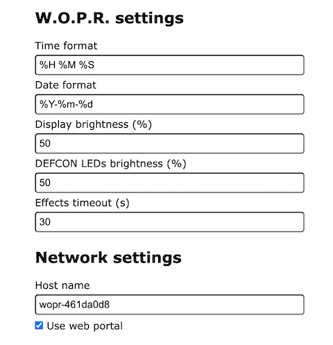

# JBWOPR

JBWopr is a helper library for the Arduino platform that allows you to easily interface with the 
Unexpected Maker W.O.P.R. board.

> Note - The Home Assistant support is still a work in progress. 

## Installation

Install using the library manager in the Arduino IDE.

## Usage

The library exposes several classes that you can use to interact with the board.

 - `JBWoprDevice` - This is the simplest class that you can use to interact with the board.
 - `JBWoprWifiDevice` - This adds WiFiManager and web configuration portal support to the `JBWoprDevice` class.
 - `JBWoprMqttDevice` - This adds MQTT support to the `JBWoprWifiDevice` class.
 - `JBWoprHomeAssistantDevice` - This adds Home Assistant support to the `JBWoprMqttDevice` class.

### Quick start

Open the example 'JBWopr_Firmware', and uncomment one of the following defines. This is a feature complete firmware
that you can also use as a starting point for your own firmware.

 - `FIRMWARE_VARIANT_WIFI` - Use the WiFiManager and web configuration portal
 - `FIRMWARE_VARIANT_MQTT` - Use the WiFiManager, web configuration portal and MQTT support
 - `FIRMWARE_VARIANT_HA` - Use the WiFiManager, web configuration portal, MQTT and Home Assistant support

### Basic JBWoprDevice usage

Create an instance of the `JBWoprDevice` class. Do any configuration you need to do then 
and call `begin()` in your `setup()` function. Then call `loop()` in your `loop()` function.

See the example 'JBWopr_DeviceDemo' for more information on the basic `JBWoprDevice` usage.

```cpp
#include <jbwopr.h>

JBWoprDevice wopr;

void setup() {
	// Configure the JBWoprDevice class
	JBWoprConfiguration* config = wopr.getConfiguration();
    config->timeFormat = "%H %M %s";
	config->dateFormat = "%Y-%m-%d";
    config->displayBrightness = 50;
    config->defconLedsBrightness = 50;
	
    // Initialize the JBWoprDevice class, passing in the board version 
    // JBWoprBoardVariant::HAXORZ or JBWoprBoardVariant::ORIGINAL
    wopr.begin(JBWoprBoardVariant::HAXORZ);
}

void loop() {
    wopr.loop();

    // Add your code here
}
```

The devices on the board are exposed via simple to use methods of the 
`JBWoprDevice` class.

```cpp
...
// Display
wopr.displaySetBrightness(50);
wopr.displaySetText("Hello World");
wopr.displaySetScrollText("Hello scrolling world");

// DEFCON
wopr.defconSetBrightness(50);
wopr.defconLedsSetDefconLebel(JBWoprDefconLevel::DEFCON1);

// Buttons
wopr.buttonFrontRightSetClickCallback(ButtonFrontRightClick);
...

void ButtonFrontRightClick() {
  Serial.println("Front right button clicked");
}
```

There is also support for running effects. There are some effects bundled with library,
but you can also create your own effects by inheriting from the `JBWoprEffectBase` class.

```cpp
#include <jbwopr.h>
#include <effects/jbwopreffets.h>
begin() {
    ...
    wopr.effectsRegisterEffect(new JBWoprMissileCodeSolveEffect(&wopr,
                               CodeSolveVariant::MOVIE,
                               1000,
                               "Movie solve"));
}

loop() {
	wopr.startEffect("Movie solve");
}
```

### Advanced usage of onboard devices

The class exposes the onboard devices as the following:

* The 12 character display are exposed as an array of `Adafruit_AlphaNum4`devices
* The 5 DEFCON LED's are exposed as a `Adafruit_NeoPixel` device
* The  buttons are exposed as `OneButton` devices

Check out the following examples for more information:

 - JBWopr_AudioDemo
 - JBWopr_ButtonDemo
 - JBWopr_DefconDemo
 - JBWopr_DisplayDemo

## JBWoprWifiDevice

The `JBWoprWifiDevice` class adds WiFiManager and web configuration portal support to the `JBWoprDevice` class.
At first boot it starts up an AP called `wopr-<mac_address>`. Connect to this AP and it will access the configuration 
portal. If it isn't opening that automatically, open the url `http://192.168.4.1` to access the portal.

Enter the details for your WiFi network and click save. The device will reboot and connect to your WiFi network.

If the _Use web portal_ setting is enabled, you can access the configuration portal by browsing to the IP address of 
the device. You can find the IP address by looking at the serial output of the device.



## JBWoprMqttDevice

The 'JBWoprMqttDevice' class adds MQTT support to the `JBWoprWifiDevice` class. It uses the PubSubClient library to
connect to an MQTT broker. It will publish the device state to the `<mqtt prefix>/<device_id>/state` topic and listen
for commands on the `<mqtt prefix>/<device_id>/command` topic.

## MQTT Topics

Device state is posted to the `<mqtt prefix>/<device_id>/<enity>/state` topic. It is posted at startup and when state is 
changed.

The following topics are used for device state reporting.

### Display

The device will post a message to the following topics when the display state is changed.

| Topic                              | Example payload       | Comment |
|------------------------------------|-----------------------|---------|
| wopr/wopr-jonny/display/state      | ON / OFF              |         |
| wopr/wopr-jonny/display/text       | Hello World           |         |
| wopr/wopr-jonny/display/scrolltext | Hello scrolling world |         |
| wopr/wopr-jonny/display/brightness | 50                    |         |

### DEFCON LED's

The device will post a message to the following topics when the DEFCON LED's state is changed.

| Topic                              | Example payload       | Comment |
|------------------------------------|-----------------------|---------|
| wopr/wopr-jonny/defcon/state       | ON / OFF              |         |
| wopr/wopr-jonny/defcon/level       | 1 / 2 / 3 / 4 / 5     |         |
| wopr/wopr-jonny/defcon/brightness  | 50                    |         |
| wopr/wopr-jonny/defcon/color       | 255,0,0               |         |

The device will listen to messages on the following topics.

| Topic                                  | Example payload       | Comment |
|----------------------------------------|-----------------------|---------|
| wopr/wopr-jonny/defcon/state/set       | ON / OFF              |         |
| wopr/wopr-jonny/display/text/set       | Hello World           |         |
| wopr/wopr-jonny/display/scrolltext/set | Hello scrolling world |         |
| wopr/wopr-jonny/display/brightness/set | 50                    |         |


### Effects

The device will post a message to the following topics when an effect state is changed.

| Topic                              | Example payload       | Comment |
|------------------------------------|-----------------------|---------|
| wopr/wopr-jonny/effect/state       | ON / OFF              |         |
| wopr/wopr-jonny/effect/name        | Rainbow               |         |

The device will listen to messages on the following topics.

| Topic                                  | Example payload       | Comment |
|----------------------------------------|-----------------------|---------|
| wopr/wopr-jonny/effect/state/set       | ON / OFF              |         |
| wopr/wopr-jonny/effect/name/set        | Rainbow               |         |

### Buttons

The device will post a message to the following topics when a button is clicked or double clicked.

| Topic                                   | Example payload      | Comment |
|-----------------------------------------|----------------------|---------|
| wopr/wopr-jonny/button_front_left/event | click / double_click |         |
| wopr/wopr-jonny/button_front_right/event| click / double_click |         |
| wopr/wopr-jonny/button_back_top/event   | click / double_click |         |
| wopr/wopr-jonny/button_back_bottom/event| click / double_click |         |

## JBWoprHomeAssistantDevice

TODO
